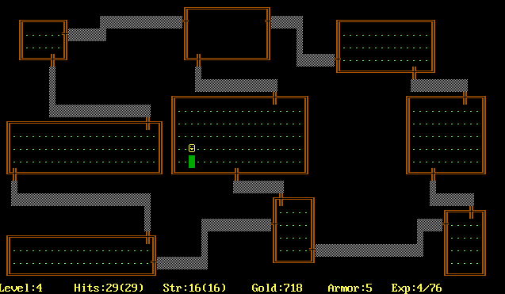

# Roguelike | Berlin Interpretation

## Introdução
Esta definição de "roguelike" foi definida pela *International Roguelike Development Conference 2008*  e é o resultado de uma discussão entre todos os participantes. A definição no http://www.roguetemple.com/roguelike-definition/  foi utilizada como ponto de partida para esta discussão. A maioria dos aspectos é recém formulada, novos aspectos foram adicionados e alguns aspectos foram removidos.

> **Nota**
>
>  Esta documentação não é simplesmente uma tradução do projeto original http://www.roguebasin.com/index.php?title=Berlin_Interpretation. Além das informações contidas na Berlin Interpretation, foram acrescentadas informações adicionadas para embasar e clarificar a definição de roguelike. Caso encontre alguma informação que discorde ou tenha a intenção de acrescentar conteúdo, sinta-se livre para enviar um pull request para este repositório.

## Princípios globais
"Roguelike" refere-se  a um gênero e não simplesmente a "like-Rogue". O gênero é representado por seu cânone[^1]. O cânone para Roguelikes é o ADOM, Angband, Crawl, NetHack e Rogue. Esta lista pode ser usada para determinar como um jogo roguelike é. Faltar alguns pontos não significa que o jogo não é um roguelike. Da mesma forma que possuir alguns pontos não significa que o jogo é um roguelike.

O propósito desta definição é ajudar a comunidade roguelike a entender melhor suas características principais, e não colocar restrições para os desenvolvedores de jogos.

**ADOM** é o acrônimo de "Ancient Domains of Mystery", um jogo RPG roguelike lançado em 1994. Este é caracterizado pelo modo single-player, exploração de dungeons complexos, grandes áreas selvagens e aldeias. O jogador controla um personagem que é descrito por raça, classe, atributos, habilidades e equipamentos. E para alcançar o objetivo principal do jogo, precisa cumprir missões secundárias, também conhecidas como quests, que tem por objetivo levar o jogador a explorar o mundo do jogo, lutar contra centenas de monstros e encontar tesouros. Como roguelikes em geral, ADOM também possui morte definitiva.

**Angband** é um termo do idioma Sindarin que pode significar tanto "Prisão de Ferro" como "Inferno de Ferro". Sindarin é um idioma artificial fictício criado por  J. R. R. Tolkien para representar a linguagem élfica. O gênero roguelike surgiu do jogo Rogue, que foi baseado em Dungeons & Dragons;  este por sua vez foi baseado nas estórias de Tolkien. Por este motivo, o termo Angband tornou-se parte do cânone roguelike com o contexto de descrever a alta dificuldade dos desafios do jogo.

**Crawl** vem do termo "Dungeon Crawl", que é basicamente um tipo de cenário encontrado nos jogos de RPG, no qual heróis exploram labirintos em calabouços, lutam contra monstros e pilham qualquer tesouro que encontrar. Em se tratando de video game, uma dungeon é normalmente um terreno gerado proceduralmente, com encontros e tesouros espalhados randomicamente. Um outro significado, mais literal, para o termo Dungeon Crawl pode ser o "Rastreamento de calabouço", uma maneira de descrever a experiência do jogador ao explorar este tipo de cenário.

**NetHack é um jogo de RPG roguelike para computador lançado em 1987, originalmente desenvolvido para rodar em modo de texto. Ele é uma evolução do jogo Hack de 1985.  O gameplay é basicamente o mesmo para jogos RPG roguelike. O nome NetHack é proveniente de dois termos: Net de Internet - devido ao desenvolvimento do jogo ter sido totalmente coordena através da Internet; e Hack refere-se ao subgênero "Hack n' Slash", devido ao seu grande foco no combate a muitos inimigos por vez.

**Rogue** é o jogo que definiu o gênero roguelike, foi lançado em 1980.  Ele é basicamente um dungeon crawling, no qual o jogador controla um personagem que deverá explorar vários níveis em um calabouço em busca do amuleto de Yendor. Através do caminho o jogador terá encontro com monstros além de coletar tesouros e itens como: armas, armaduras, poções, pergaminhos e outros itens mágicos. Tanto os níveis quanto os encontros com os montros e localizações dos itens, são gerados proceduralmente, ou seja, cada vez que o jogador joga ROgue ele terá uma experiência totalmente nova, pois nada se repete. O intervalo de tempo em Rogue é baseado em turnos e o playfield é representado através de uma grid retangular renderizada em ASCII - na verdade toda a arte de Rogue foi construída em ASCII. Rogue implementou o conceito de morte permanente, essa foi uma decisão de game design para tornar cada ação do jogador extremamente significativa. Caso o personagem morra, o jogador deverá iniciar um novo jogo com um novo personagem, ou seja, não poderá recarregar a partir de um estado salvo com o personagem anterior.

Rogue foi inspirado em jogos baseados em texto como Colossal Cave Adventure, de 1976, em conjunto com cenários de fantasia baseados no RPG de mesa Dungeos & Dragons.

Apesar de Rogue não ter sido o pioneiro nos jogos de RPG com dinâmica dungeon crawling com mapas e encontros procedurais, ele se tornou referência para este novo gênero de jogo devido a sua grande popularidade.

## Referências

1. [Ancient Domains of Mystery. Wikipedia][1]
2. [Angband. Istya][2]
3. [Sindarin. Wikipedia][3]
4. [Dungeon Crawl. Wikipedia][4]
5. [Rogue (video game). Wikipedia][5]

---

[^1]: Cânone, dentro deste contexto, significa regra, preceito ou norma.

[1]:https://en.wikipedia.org/wiki/Ancient_Domains_of_Mystery
[2]:http://www.tolkienianos.pt/istya/index.php?view=105
[3]:https://pt.wikipedia.org/wiki/Sindarin
[4]:https://en.wikipedia.org/wiki/Dungeon_crawl
[5]: https://en.wikipedia.org/wiki/Rogue_(video_game)