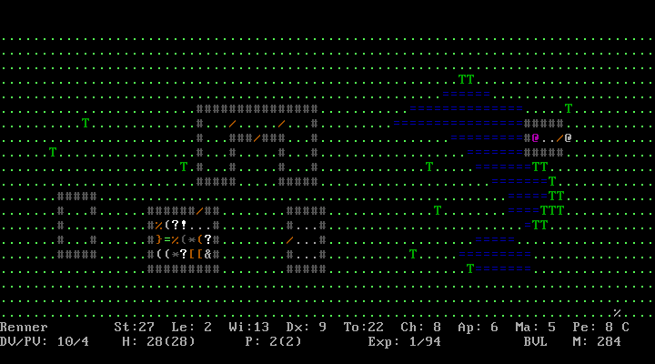
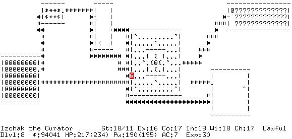
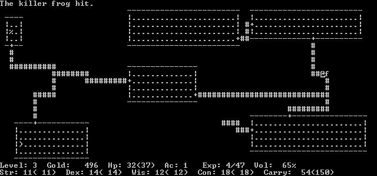

<!-- MarkdownTOC -->

- [Roguelike | Berlin Interpretation](#roguelike-|-berlin-interpretation)
    - [Introdução](#introdução)
    - [Princípios globais](#princípios-globais)
    - [Aspectos de alto valor](#aspectos-de-alto-valor)
        - [Geração de ambiente randômico](#geração-de-ambiente-randômico)
        - [Permadeath \(Morte permanente\)](#permadeath-morte-permanente)
        - [Intervalo de tempo baseado em turnos](#intervalo-de-tempo-baseado-em-turnos)
        - [Playfield baseado em grid](#playfield-baseado-em-grid)
        - [Não-modal](#não-modal)
        - [Complexidade](#complexidade)
        - [Gerenciamento de recurso](#gerenciamento-de-recurso)
        - [Hack n' Slash](#hack-n-slash)
        - [Exploração e Descoberta](#exploração-e-descoberta)
    - [Aspectos de baixo valor](#aspectos-de-baixo-valor)
        - [Modo de jogador Single player](#modo-de-jogador-single-player)
        - [Monstros são similares ao jogador](#monstros-são-similares-ao-jogador)
        - [Desafio tático](#desafio-tático)
        - [ASCII display](#ascii-display)
        - [Dungeons](#dungeons)
        - [Números](#números)
    - [Controvérsia](#controvérsia)
    - [Nota pessoal](#nota-pessoal)
    - [Referências](#referências)

<!-- /MarkdownTOC -->

---

<a name="roguelike-|-berlin-interpretation"></a>
# Roguelike | Berlin Interpretation

<a name="introdução"></a>
## Introdução
Esta definição de "roguelike" foi definida pela *International Roguelike Development Conference 2008*  e é o resultado de uma discussão entre todos os participantes. A definição no http://www.roguetemple.com/roguelike-definition/  foi utilizada como ponto de partida para esta discussão. A maioria dos aspectos é recém formulada, novos aspectos foram adicionados e alguns aspectos foram removidos.

> **Nota**
>
>  Esta documentação não é simplesmente uma tradução do projeto original http://www.roguebasin.com/index.php?title=Berlin_Interpretation. Além das informações contidas na Berlin Interpretation, foram acrescentadas informações adicionais para embasar e clarificar a definição de roguelike segundo a Berlin Interpretation
>  
>  Vale ressaltar que esta definição não é uma regra de ouro, e é mais voltada aos conceitos dos jogos clássicos roguelike.

<a name="princípios-globais"></a>
## Princípios globais
"Roguelike" refere-se  a um gênero e não simplesmente a "like-Rogue". O gênero é representado por seu [cânone¹](#canone)<a name="canone-texto"></a>. O cânone para Roguelikes é o ADOM, Angband, Crawl, NetHack e Rogue. Esta lista pode ser usada para determinar como um jogo roguelike é. Faltar alguns pontos não significa que o jogo não é um roguelike. Da mesma forma que possuir alguns pontos não significa que o jogo é um roguelike.

O propósito desta definição é ajudar a comunidade roguelike a entender melhor suas características principais, e não colocar restrições para os desenvolvedores de jogos.

**ADOM** é o acrônimo de "Ancient Domains of Mystery", um jogo RPG roguelike lançado em 1994. Este é caracterizado pelo modo single-player, exploração de dungeons complexos, grandes áreas selvagens e aldeias. O jogador controla um personagem que é descrito por raça, classe, atributos, habilidades e equipamentos. E para alcançar o objetivo principal do jogo, precisa cumprir missões secundárias, também conhecidas como quests, que tem por objetivo levar o jogador a explorar o mundo do jogo, lutar contra centenas de monstros e encontar tesouros. Como roguelikes em geral, ADOM também possui morte definitiva.



*Screenshot do jogo ADOM de 1994*  


**Angband** é um jogo de RPG roguelike para computador lançado em 1990, baseado no jogo Moria - este por sua vez baseado no jogo Rogue. Angband vem das estórias de Tolkien, no qual este é uma fortaleza de Morgoth. Angband é um termo do idioma Sindarin que pode significar tanto "Prisão de Ferro" como "Inferno de Ferro". Sindarin é um idioma artificial fictício criado por  J. R. R. Tolkien para representar a linguagem élfica.


*Screenshot do jogo Agband de 1990, level Bree*  


**Crawl** ou Linley's Dungeon Crawl é um jogo roguelike lançado em 1997. O jogo inicia com o jogador tendo que escolher uma dentre vinte raças possíveis, algumas delas são: elfos, anões, humanos, ogro, centauro, dentre muitas e muitas outras. Cada raça determina o seu conjunto de atributos, habilidades e características físicas como movimento, resitências e habilidades especiais. Uma das mecânicas centrais dentro de Crawl é a religião, com um panteão diversos de deuses que irão recompensar o jogador de acordo com seu código de conduta. O objetivo principal de Crawl é recuperar o Orbe de Zot, escondido dentro de um complexo dungeon. Para alcançar o objetivo o jogador terá que explorar todo o mundo do jogo.

A versão mais recente é o jogo *Dungeon Crawl Stone Soup*, lançado em 2006. Ele é totalmente free open source, e pode ser encontrado no seguinte repositório: https://github.com/crawl/crawl.

Crawl terminou virando também um termo, "Dungeon Crawl", que é basicamente um tipo de cenário encontrado nos jogos de RPG, no qual heróis exploram labirintos em calabouços, lutam contra monstros e pilham qualquer tesouro que encontrar. Em se tratando de video game, uma dungeon é normalmente um terreno gerado proceduralmente, com encontros e tesouros espalhados randomicamente. Um outro significado, mais literal, para o termo Dungeon Crawl pode ser o "Rastreamento de calabouço", uma maneira de descrever a experiência do jogador ao explorar este tipo de cenário.


*Screenshot do jogo Linley's Dungeon Crawl, de 1997*  

**NetHack** é um jogo de RPG roguelike para computador lançado em 1987, originalmente desenvolvido para rodar em modo de texto. Ele é uma evolução do jogo Hack de 1985.  O gameplay é basicamente o mesmo para jogos RPG roguelike. O nome NetHack é proveniente de dois termos: Net de Internet - devido ao desenvolvimento do jogo ter sido totalmente coordenado através da Internet; e Hack refere-se ao subgênero "Hack n' Slash", devido ao seu grande foco no combate a muitos inimigos por vez.



*Screenshot do nível Óraculo do jogo NetHack de 1987*  

**Rogue** é o jogo que definiu o gênero roguelike, foi lançado em 1980.  Ele é basicamente um dungeon crawling, no qual o jogador controla um personagem que deverá explorar vários níveis em um calabouço em busca do amuleto de Yendor. Através do caminho o jogador terá encontro com monstros além de coletar tesouros e itens como: armas, armaduras, poções, pergaminhos e outros itens mágicos. Tanto os níveis quanto os encontros com os montros e localizações dos itens, são gerados proceduralmente, ou seja, cada vez que o jogador joga Rogue ele terá uma experiência totalmente nova, pois nada se repete. O intervalo de tempo em Rogue é baseado em turnos e o playfield é representado através de uma grid retangular renderizada em ASCII - na verdade toda a arte de Rogue foi construída em ASCII. Rogue implementou o conceito de morte permanente, essa foi uma decisão de game design para tornar cada ação do jogador extremamente significativa. Caso o personagem morra, o jogador deverá iniciar um novo jogo com um novo personagem, ou seja, não poderá recarregar a partir de um estado salvo com o personagem anterior.



*Screenshot do jogo Rogue, de 1980*  


*Screenshot da versão de 1983 do jogo Rogue para um PC IBM com monitor colorido*  

Rogue foi inspirado em jogos baseados em texto como Colossal Cave Adventure, de 1976, em conjunto com cenários de fantasia baseados no RPG de mesa Dungeons & Dragons.

Apesar de Rogue não ter sido o pioneiro nos jogos de RPG com dinâmica dungeon crawling com mapas e encontros procedurais, ele se tornou referência para este novo gênero de jogo devido a sua grande popularidade.

<a name="aspectos-de-alto-valor"></a>
## Aspectos de alto valor

<a name="geração-de-ambiente-randômico"></a>
### Geração de ambiente randômico
O mundo do jogo é gerado de forma procedural e randômica, esta abordagem aumenta a reprodutibilidade do jogo.  Aparência e localização dos itens são randômicas. Aparência dos monstros é fixa, porém sua localização é randômica. O conteúdo fixo (enredo, puzzle ou vault) elimina a aleatóriedade.

<a name="permadeath-morte-permanente"></a>
### Permadeath (Morte permanente)
Não espere vencer o jogo com o seu primeiro personagem. Você começa novamente do primeiro nível e com um novo personagem quando morre (e qualquer save file é deletado). A geração randômica de ambientes torna agradável a nova experiência e diminui a frustração pela baixa leniência do jogo. Jogos roguelike tendem a ser extremamente punitivos.

<a name="intervalo-de-tempo-baseado-em-turnos"></a>
### Intervalo de tempo baseado em turnos
Cada comando corresponde a uma única ação/movimento. O jogo não é sensível ao tempo, ou seja, o jogador tem todo o tempo que precisar para decidir sobre qual ação realizar.

<a name="playfield-baseado-em-grid"></a>
### Playfield baseado em grid
O mundo do jogo é representado através de uma grid de tiles uniformes. Monstros e jogador ocupam um tile, independente de seu tamanho.

<a name="não-modal"></a>
### Não-modal
Movimento, batalha e outras ações ocorrem do mesmo modo. Cada ação deverá estar disponível em qualquer ponto do jogo, as violações a esta regra são os mundos superiores de ADOM ou as lojas de Angband e de Crawl.

<a name="complexidade"></a>
### Complexidade
O jogo deverá ser complexo o suficiente para permitir múltiplas soluções para objetivos comuns. Isso poderá ser obtido provendo uma variedade suficiende de item/monstro e item/item interação.

<a name="gerenciamento-de-recurso"></a>
### Gerenciamento de recurso
O jogador terá que gerenciar recursos limitados (comida, poções de vida) e encontrar uso para os recursos que recebe.

<a name="hack-n-slash"></a>
### Hack n' Slash
Embora possam existir muitas outras dinâmicas para o jogo, matar uma grande quantidade de monstros é a parte mais importante de um roguelike. O jogo é jogador vs. mundo: não existem relações monstro/montsro (como inimizades ou diplomacia).

<a name="exploração-e-descoberta"></a>
### Exploração e Descoberta
O jogo requer uma cuidadosa exploração de cada nível da dungeon, além da descoberta do uso de itens não identificados. 


<a name="aspectos-de-baixo-valor"></a>
## Aspectos de baixo valor

<a name="modo-de-jogador-single-player"></a>
### Modo de jogador Single player
O jogador controla apenas um único personagem. O jogo é centrado no jogador, o mundo é visto através desse único personagem e a morte dele é o fim do jogo.

<a name="monstros-são-similares-ao-jogador"></a>
### Monstros são similares ao jogador
As mesmas regras que se aplicam para o jogador, aplicam-se também para os monstros. Eles tem inventários, equipamentos, itens de uso, lançam feitiços, etc.

<a name="desafio-tático"></a>
### Desafio tático
O jogador deverá aprender sobre as táticas de jogo antes de realizar um progresso significativo. Esse processo se repete, ou seja, o conhecimento inicial do jogo não é suficiente para vencer o jogo final - devido aos ambientes, encontros randômicos e a morte permanente, roguelikes são extremamente desafiadores para jogadores novos. O foco do jogo está em prover desafios táticos (ao contrário de trabalhar estrategicamente no cenário geral ou de resolver puzzles).

<a name="ascii-display"></a>
### ASCII display
O display dos jogos tradicionais roguelike é representado através de um tiled world criado com caracteres ASCII.

<a name="dungeons"></a>
### Dungeons
Roguelikes contém dungeons, com níveis compostos de salas e corredores.

<a name="números"></a>
### Números
Os números usados para descrever o personagem - ponto de vida, atributo, etc., são exibidos explícitamente.

<a name="controvérsia"></a>
## Controvérsia
Em seu artigo [Screw the Berlin Interpretation][9], [Darren Grey][10] acusa o Berlin Interpretation de ser impreciso, desatualizado e não representativo de um gênero tão aberto e vibrante. Em particular, ele ridiculariza recursos como ASCII e Dungeons como sendo irrelevantes para um gênero que tradicionalmente prioriza a mecânica de jogo sobre a estética ou sua configuração. Ele critica o uso comum da Berlin Interpretation como a definição do roguelike.

Na comunidade de jogos o termo "roguelike" ou  "com elementos roguelike" são os mais popularmente utilizados para descrever qualquer jogo que combina a morte permanente com conteúdo procedural.

---

<a name="nota-pessoal"></a>
## Nota pessoal
```
Autor: Thiago Teles

```
Particularmente, eu concordo com a visão de Darren Grey, porém ao mesmo tempo consigo entender a definição da Berlin Interpretation sobre roguelike. Basicamente a Berlin busca uma definição purista do gênero, trazendo para o conceito os aspectos fundamentais dos primeiros jogos do gênero. Porém como game designers, precisamos lembrar que jogos puristas são uma exceção, na verdade é um nicho bastante específico.

O que vale ressaltar é que não existe uma regra de ouro ou um guia de como fazer de "maneira correta" um jogo roguelike. Esqueça, isso não existe. O mais importante ao olhar para conceitos clássicos, como o da Berlin Interpretation, é entender a história desses jogos, é entender porque cada um desses aspectos foi colocado em cada um desses jogos e porque a ênfase de cada aspecto é diferente em cada jogo. Ou seja, o mais importante é entender como o game designer pensou durante o processo de construção do jogo. Essa visão é o que permitirá que apliquemos os conceitos basais do roguelike nos nossos projetos, além de permitir que esse gênero evolua.


<a name="referências"></a>
## Referências

1. [Ancient Domains of Mystery. Wikipedia][1]
2. [Angband. Istya][2]
3. [Angband (jogo eletrônico). Wikipedia][6]
4. [Sindarin. Wikipedia][3]
5. [Linley's Dungeon Crawl. Wikipedia][7]
6. [Dungeon Crawl. Wikipedia][4]
7. [Dungeon Crawl: Stone Soup. Github][8]
8. [Rogue (video game). Wikipedia][5]

---
<a name="canone"></a>
1. *Cânone, dentro deste contexto, significa regra, preceito ou norma.* | [*voltar para o texto ⤴*](#canone-texto)


[1]:https://en.wikipedia.org/wiki/Ancient_Domains_of_Mystery
[2]:http://www.tolkienianos.pt/istya/index.php?view=105
[3]:https://pt.wikipedia.org/wiki/Sindarin
[4]:https://en.wikipedia.org/wiki/Dungeon_crawl
[5]:https://en.wikipedia.org/wiki/Rogue_(video_game)
[6]:https://pt.wikipedia.org/wiki/Angband_(jogo_eletrônico)
[7]:https://en.wikipedia.org/wiki/Linley's_Dungeon_Crawl 
[8]: https://github.com/crawl/crawl
[9]: http://www.gamesofgrey.com/blog/?p=403
[10]: http://www.roguebasin.com/index.php?title=Darren_Grey